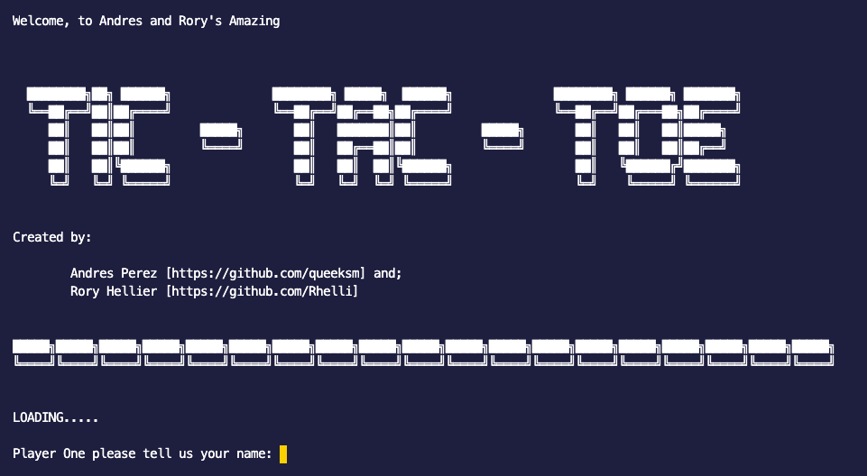

  

  

  
  # 🕹️ Tic-Tac-Toe - Object Oriented Programming
  

  

    An exercise in OOP using Ruby to create a command line Tic-Tac-Toe game
     
    <a href="https://github.com/queeksm/Tic-Tac-Toe/tree/master"><strong>Explore This Repository »</strong></a>
     
     
    <a href="https://github.com/queeksm/Tic-Tac-Toe/archive/master.zip">Download The Game</a>
    ·
    <a href="https://github.com/queeksm/Tic-Tac-Toe/issues">Report A Bug</a>
    ·
    <a href="https://github.com/queeksm/Tic-Tac-Toe/fork">Fork It</a>
  

## Table of Contents
- [About This Project](#about-this-project)
- [The Project Brief](#the-project-brief)
- [Technologies &amp; Languages Used](#technologies-amp-languages-used)
- [How To Play](#how-to-play)
  - [Requirements](#requirements)
  - [Setup](#setup)
  - [Let's Play!](#lets-play)
- [Contributions, Issues and Forking](#contributions-issues-and-forking)
- [Creators](#creators)
- [Show Your Support](#show-your-support)
- [Licensing](#licensing)

## ❓ About This Project

This project is part of a series of projects to be completed by students of [Microverse](https://www.microverse.org/ 'The Global School for Remote Software Developers!').

This project consisted of creating a Tic-Tac-Toe game to be run from the command line, with the purpose of practicing and exercising the main concepts of Object Oriented Programming.

## 🚧 The Project Brief

The project specification and assinment details are part of The Odin Project's Ruby Programming course, which can be found [here.](https://www.theodinproject.com/courses/ruby-programming/lessons/oop)

This project was split up into four key milestones:
1. **Project** Setup - creating the two main directories: **lib**       for game    logic and **bin* for the executable file

2. **User Interface** - Creating the main play flow, user                           interactions and messages and all other 'content' for the game.

3. **Game Logic** - Creation of all classes and methods to make the     game        run. This is the main 'engine' of the game.

4. **ReadMe** / Further Intructions

## 🔨 Technologies & Languages Used

- Ruby
- Rubocop
- Stickler-CI

## 👾 How To Play
### Requirements
You must have Ruby downloaded and available on your computer. If you do not, you can download it [here.](https://www.ruby-lang.org/en/downloads/)

___

### Setup
1. Download this repo and place it somewhere accessible and convenient.

3. The file you will use to run the game is the **main** file, located in the       **bin** folder. If you cannot run the file out of the box, give the **main**     file execute permissions using the following command in terminal:

        `chmod +x bin/main`

    This will allow you to double click the file and run it easily.

4. You will then be able to open the game by entering the following command into your terminal:

        `ruby ./bin/main`

> NB. In order for the two commands above to successfully be implemented in your terminal, you must navigate to the directory in which the game is located. [HELP IS HERE](https://help.ubuntu.com/community/UsingTheTerminal)

___

### Let's Play!
Just incase you're not too familiar with the game of Tic-Tac-Toe (or Noughts and Crosses for that matter), it goes a little something like this:

- The game is played on a 3x3 board
- Each player is assigned either a 'O' or a 'X' at the start of the game
- The objective of the game is to line up three of your 'X's or 'O's either horizontally,          vertically or diagonally.
- Each player has one move per turn.
- If neither player lines up their 'X's or 'O's, then it's a draw!

Instructions are also optionally available in-game in case you forget!

## 🥂 Contributions, Issues and Forking

Contributions, issues and feature requests are more than welcome! 

If you have any problems running or setting up the game, please do check out the [issues page.](https://github.com/queeksm/Tic-Tac-Toe/issues)

If you want to make your own changes, modifications or improvements, go ahead and Fork it!
1. Fork it (https://github.com/queeksm/Tic-Tac-Toe/fork)
2. Create your working branch (git checkout -b [choose-a-name])
3. Commit your changes (git commit -am 'what this commit will fix/add/improve')
4. Push to the branch (git push origin [chosen-name])
5. Create a new Pull Request

## 👨🏽‍💻 👨🏿‍💻 Creators

Rory Hellier - [Github](https://github.com/Rhelli)

Andres Perez - [GitHub](https://github.com/queeksm)

## 🖐🏼 Show Your Support

Give a ⭐️ if you like this project!

## ⚖️ Licensing

This project is [MIT](https://github.com/queeksm/Tic-Tac-Toe/LICENSE.txt) licensed.
